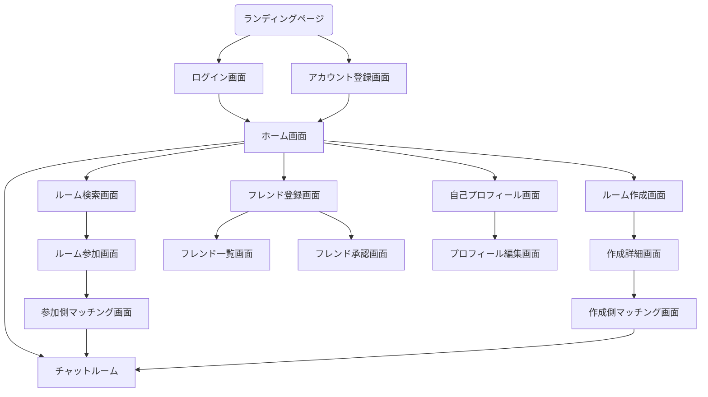

# 画面遷移図

## 概要
このドキュメントでは、USJマッチングアプリの画面遷移について説明します。

## 画面遷移図

## 画面説明

### 1. ランディングページ
- アプリの概要説明
- ログイン画面へのリンク
- アカウント登録画面へのリンク

### 2. ログイン画面
- メールアドレスとパスワードによるログイン
- アカウント登録へのリンク
- パスワードリセットへのリンク

### 3. アカウント登録画面
- 新規ユーザー登録フォーム
- メールアドレス確認機能
- 利用規約同意

### 4. ホーム画面（ルーム検索画面をホーム画面にする予定）
- ルーム検索へのリンク
- ルーム作成へのリンク
- チャットルーム一覧
- フレンド登録へのリンク
- 自己プロフィールへのリンク

### 5. ルーム検索画面
- ルーム一覧表示
- 検索・フィルター機能
- ルーム参加へのリンク

### 6. ルーム参加画面
- ルーム詳細情報の表示
- 参加条件の確認
- 参加側マッチング画面へのリンク

### 7. 参加側マッチング画面
- マッチング条件の設定
- マッチング待機状態の表示
- チャットルームへの遷移

### 8. ルーム作成画面
- ルーム作成フォーム
- 基本情報の入力
- 作成詳細画面へのリンク

### 9. 作成詳細画面
- 詳細設定の入力
- マッチング条件の設定
- 作成側マッチング画面へのリンク

### 10. 作成側マッチング画面
- マッチング待機状態の表示
- 参加者情報の確認
- チャットルームへの遷移

### 11. チャットルーム
- メッセージの送受信
- 参加者一覧の表示
- メッセージ履歴の表示
- ルーム情報の表示

### 12. フレンド登録画面
- フレンド検索機能
- フレンド一覧へのリンク
- フレンド承認へのリンク

### 13. フレンド一覧画面
- 登録済みフレンドの表示
- フレンドとのチャット開始
- フレンド情報の表示

### 14. フレンド承認画面
- フレンドリクエストの表示
- 承認/拒否機能
- フレンド一覧への遷移

### 15. 自己プロフィール画面
- ユーザー情報の表示
- プロフィール編集へのリンク
- アカウント設定へのリンク

### 16. プロフィール編集画面
- プロフィール情報の編集
- プロフィール画像の変更
- 設定の保存

