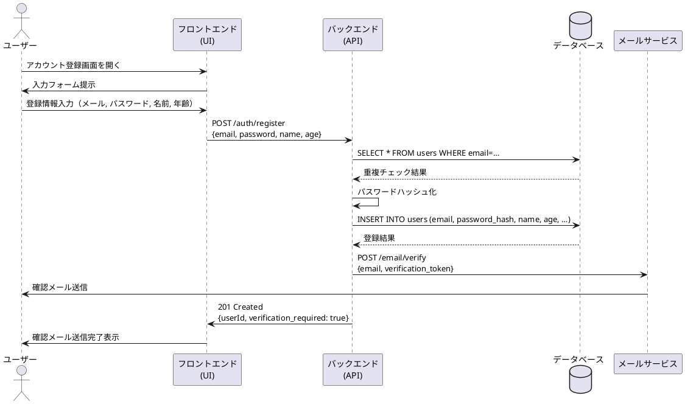
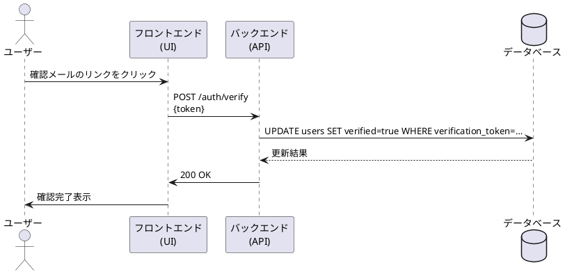
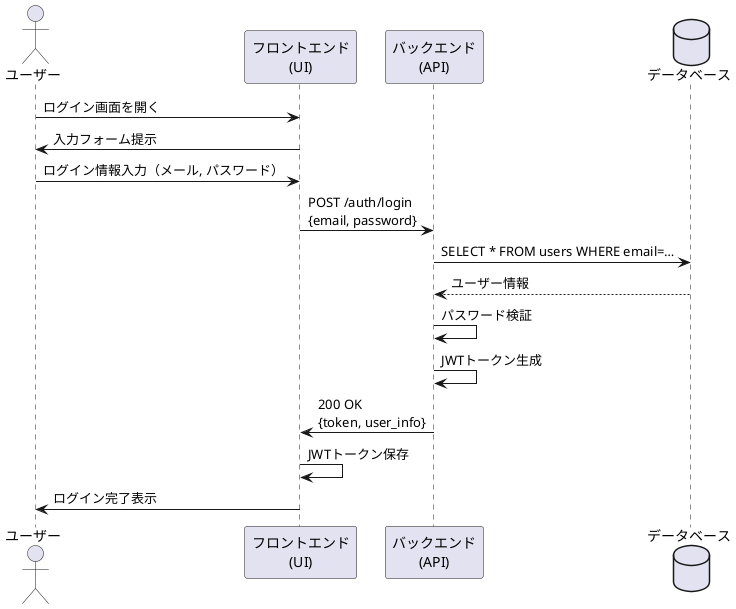
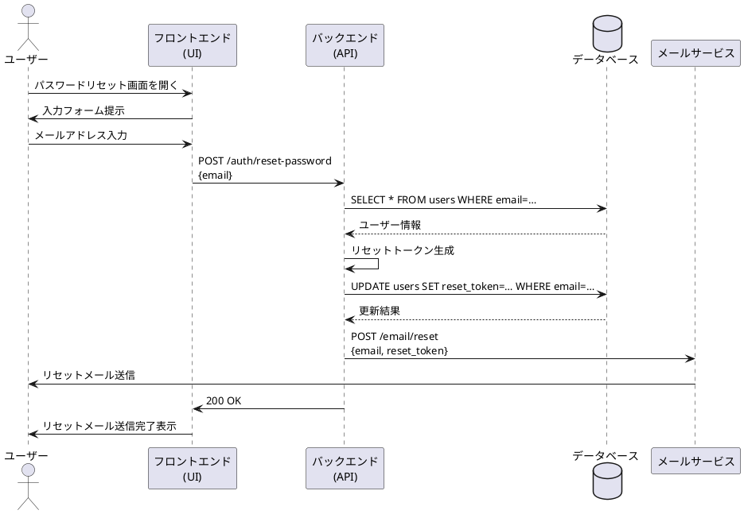

# 認証機能シーケンス図

## 概要
このドキュメントでは、USJマッチングアプリにおける認証機能（ログイン、アカウント登録）のシーケンスについて説明します。

## アクター
- ユーザー（User）
- フロントエンド（UI）
- バックエンド（API）
- データベース（DB）
- メールサービス（Email Service）

## シーケンスの流れ

### 1. アカウント登録
1. ユーザーがアカウント登録画面を開く
2. フロントエンドがユーザーに入力フォームを提示
3. ユーザーが登録情報を入力
   - 入力項目: メールアドレス, パスワード, 名前, 年齢 など
4. フロントエンドがバックエンドに登録リクエストを送信
   - エンドポイント: POST /auth/register
   - リクエストボディ: 登録情報
5. バックエンドがメールアドレスの重複チェック
   - クエリ: SELECT * FROM users WHERE email=…
6. データベースがチェック結果を返却
7. バックエンドがパスワードをハッシュ化
8. バックエンドがデータベースにユーザー情報を登録
   - クエリ: INSERT INTO users (email, password_hash, name, age, …)
9. データベースが登録結果を返却
10. バックエンドがメールサービスに確認メールを送信
    - エンドポイント: POST /email/verify
    - リクエストボディ: email, verification_token
11. メールサービスがユーザーに確認メールを送信
12. バックエンドがフロントエンドに登録完了を通知
    - ステータス: 201 Created
    - レスポンス: userId, verification_required: true
13. フロントエンドがユーザーに確認メール送信完了を表示

### 2. メール確認
1. ユーザーが確認メールのリンクをクリック
2. フロントエンドがバックエンドに確認リクエストを送信
   - エンドポイント: POST /auth/verify
   - リクエストボディ: token
3. バックエンドがデータベースのユーザー情報を更新
   - クエリ: UPDATE users SET verified=true WHERE verification_token=…
4. データベースが更新結果を返却
5. バックエンドがフロントエンドに確認完了を通知
   - ステータス: 200 OK
6. フロントエンドがユーザーに確認完了を表示

### 3. ログイン
1. ユーザーがログイン画面を開く
2. フロントエンドがユーザーに入力フォームを提示
3. ユーザーがログイン情報を入力
   - 入力項目: メールアドレス, パスワード
4. フロントエンドがバックエンドにログインリクエストを送信
   - エンドポイント: POST /auth/login
   - リクエストボディ: email, password
5. バックエンドがデータベースからユーザー情報を取得
   - クエリ: SELECT * FROM users WHERE email=…
6. データベースがユーザー情報を返却
7. バックエンドがパスワードを検証
8. バックエンドがJWTトークンを生成
9. バックエンドがフロントエンドにログイン成功を通知
   - ステータス: 200 OK
   - レスポンス: token, user_info
10. フロントエンドがJWTトークンを保存
11. フロントエンドがユーザーにログイン完了を表示

### 4. パスワードリセット
1. ユーザーがパスワードリセット画面を開く
2. フロントエンドがユーザーに入力フォームを提示
3. ユーザーがメールアドレスを入力
4. フロントエンドがバックエンドにリセットリクエストを送信
   - エンドポイント: POST /auth/reset-password
   - リクエストボディ: email
5. バックエンドがデータベースからユーザー情報を取得
   - クエリ: SELECT * FROM users WHERE email=…
6. データベースがユーザー情報を返却
7. バックエンドがリセットトークンを生成
8. バックエンドがデータベースにリセットトークンを保存
   - クエリ: UPDATE users SET reset_token=… WHERE email=…
9. データベースが更新結果を返却
10. バックエンドがメールサービスにリセットメールを送信
    - エンドポイント: POST /email/reset
    - リクエストボディ: email, reset_token
11. メールサービスがユーザーにリセットメールを送信
12. バックエンドがフロントエンドにリセットメール送信完了を通知
    - ステータス: 200 OK
13. フロントエンドがユーザーにリセットメール送信完了を表示

## シーケンス図

### アカウント登録

### メール確認

### ログイン

### パスワードリセット
