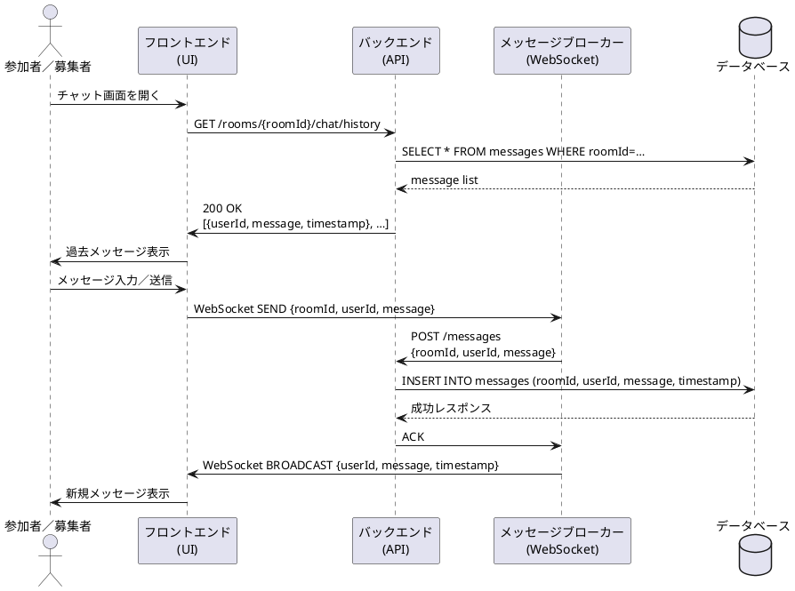

# チャット機能シーケンス図

## 概要
このドキュメントでは、USJマッチングアプリにおけるチャット機能のシーケンスについて説明します。

## アクター
- 参加者／募集者（User）
- フロントエンド（UI）
- バックエンド（API）
- メッセージブローカー（WebSocket）
- データベース（DB）

## シーケンスの流れ

### 1. チャット履歴の表示
1. ユーザーがチャット画面を開く
2. フロントエンドがバックエンドにチャット履歴をリクエスト
   - エンドポイント: GET /rooms/{roomId}/chat/history
3. バックエンドがデータベースからメッセージを取得
   - クエリ: SELECT * FROM messages WHERE roomId=…
4. データベースがメッセージリストを返却
5. バックエンドがフロントエンドにメッセージリストを返却
   - ステータス: 200 OK
   - レスポンス: メッセージ情報のリスト
6. フロントエンドがユーザーに過去のメッセージを表示

### 2. メッセージの送信
1. ユーザーがメッセージを入力して送信
2. フロントエンドがメッセージブローカーにメッセージを送信
   - 方式: WebSocket SEND
   - 内容: roomId, userId, message
3. メッセージブローカーがバックエンドにメッセージを転送
   - エンドポイント: POST /messages
   - リクエストボディ: roomId, userId, message
4. バックエンドがデータベースにメッセージを保存
   - クエリ: INSERT INTO messages (roomId, userId, message, timestamp)
5. データベースが成功レスポンスを返却
6. バックエンドがメッセージブローカーに確認応答を返却
   - レスポンス: ACK
7. メッセージブローカーがフロントエンドにメッセージをブロードキャスト
   - 方式: WebSocket BROADCAST
   - 内容: userId, message, timestamp
8. フロントエンドがユーザーに新規メッセージを表示

## シーケンス図
