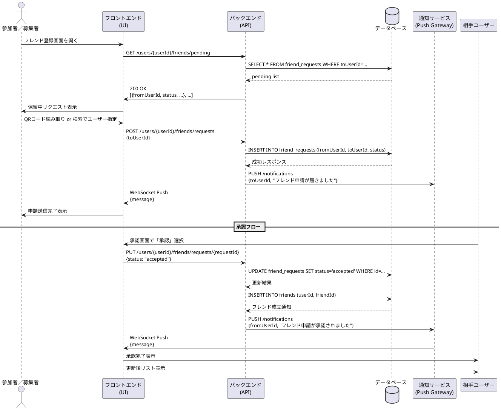

# フレンド登録シーケンス図

## 概要
このドキュメントでは、USJマッチングアプリにおけるフレンド登録機能のシーケンスについて説明します。

## アクター
- 参加者／募集者（User）
- フロントエンド（UI）
- バックエンド（API）
- データベース（DB）
- 通知サービス（Push Gateway）
- 相手ユーザー（TargetUser）

## シーケンスの流れ

### 1. フレンド登録画面の表示
1. ユーザーがフレンド登録画面を開く
2. フロントエンドがバックエンドに保留中のリクエストをリクエスト
   - エンドポイント: GET /users/{userId}/friends/pending
3. バックエンドがデータベースから保留中のリクエストを取得
   - クエリ: SELECT * FROM friend_requests WHERE toUserId=…
4. データベースが保留中のリクエストリストを返却
5. バックエンドがフロントエンドにリクエストリストを返却
   - ステータス: 200 OK
   - レスポンス: リクエスト情報のリスト
6. フロントエンドがユーザーに保留中のリクエストを表示

### 2. フレンド申請の送信
1. ユーザーがQRコード読み取りまたは検索でユーザーを指定
2. フロントエンドがバックエンドにフレンド申請を送信
   - エンドポイント: POST /users/{userId}/friends/requests
   - リクエストボディ: toUserId
3. バックエンドがデータベースにフレンド申請を登録
   - クエリ: INSERT INTO friend_requests (fromUserId, toUserId, status)
4. データベースが成功レスポンスを返却
5. バックエンドが通知サービスにプッシュ通知を要求
   - エンドポイント: PUSH /notifications
   - リクエストボディ: toUserId, "フレンド申請が届きました"
6. 通知サービスがフロントエンドに通知を送信
   - 方式: WebSocket Push
   - 内容: メッセージ
7. フロントエンドがユーザーに申請送信完了を表示

### 3. フレンド申請の承認
1. 相手ユーザーが承認画面で「承認」を選択
2. フロントエンドがバックエンドに承認リクエストを送信
   - エンドポイント: PUT /users/{userId}/friends/requests/{requestId}
   - リクエストボディ: status: "accepted"
3. バックエンドがデータベースのリクエストステータスを更新
   - クエリ: UPDATE friend_requests SET status='accepted' WHERE id=…
4. データベースが更新結果を返却
5. バックエンドがデータベースにフレンド関係を登録
   - クエリ: INSERT INTO friends (userId, friendId)
6. データベースがフレンド成立通知を返却
7. バックエンドが通知サービスにプッシュ通知を要求
   - エンドポイント: PUSH /notifications
   - リクエストボディ: fromUserId, "フレンド申請が承認されました"
8. 通知サービスがフロントエンドに通知を送信
   - 方式: WebSocket Push
   - 内容: メッセージ
9. フロントエンドが相手ユーザーに承認完了を表示
10. フロントエンドが相手ユーザーに更新後のリストを表示

## シーケンス図
