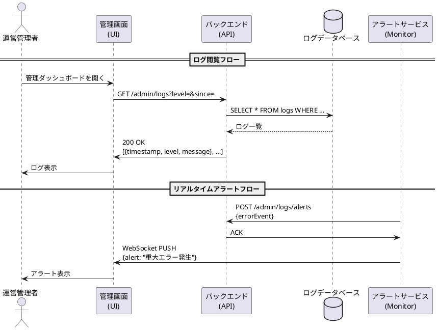

# ログ監視シーケンス図

## 概要
このドキュメントでは、USJマッチングアプリにおけるログ監視機能のシーケンスについて説明します。

## アクター
- 運営管理者（Admin）
- 管理画面（UI）
- バックエンド（API）
- ログデータベース（LogDB）
- アラートサービス（Monitor）

## シーケンスの流れ

### 1. ログ閲覧フロー
1. 運営管理者が管理ダッシュボードを開く
2. 管理画面がバックエンドにログ情報をリクエスト
   - エンドポイント: GET /admin/logs
   - パラメータ: level, since
3. バックエンドがログデータベースからログを取得
   - クエリ: SELECT * FROM logs WHERE …
4. ログデータベースがログ一覧を返却
5. バックエンドが管理画面にログ情報を返却
   - ステータス: 200 OK
   - レスポンス: ログ情報のリスト
6. 管理画面が運営管理者にログを表示

### 2. リアルタイムアラートフロー
1. アラートサービスがバックエンドにアラートを送信
   - エンドポイント: POST /admin/logs/alerts
   - リクエストボディ: errorEvent
2. バックエンドがアラートサービスに確認応答を返却
   - レスポンス: ACK
3. アラートサービスが管理画面にプッシュ通知を送信
   - 方式: WebSocket PUSH
   - 内容: alert: "重大エラー発生"
4. 管理画面が運営管理者にアラートを表示

## シーケンス図
