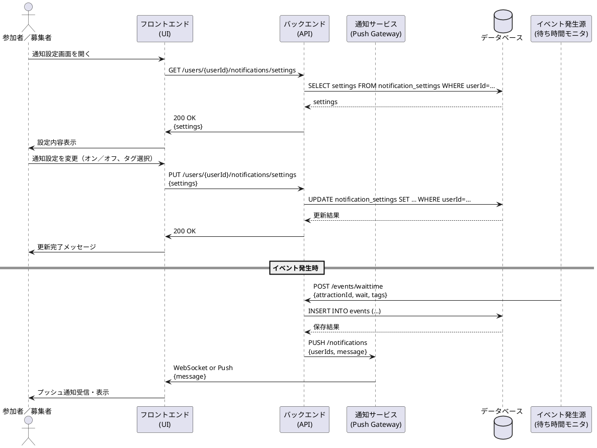

# 通知機能シーケンス図

## 概要
このドキュメントでは、USJマッチングアプリにおける通知機能のシーケンスについて説明します。

## アクター
- 参加者／募集者（User）
- フロントエンド（UI）
- バックエンド（API）
- 通知サービス（Push Gateway）
- データベース（DB）
- イベント発生源（待ち時間モニタ）

## シーケンスの流れ

### 1. 通知設定の表示
1. ユーザーが通知設定画面を開く
2. フロントエンドがバックエンドに通知設定をリクエスト
   - エンドポイント: GET /users/{userId}/notifications/settings
3. バックエンドがデータベースから設定を取得
   - クエリ: SELECT settings FROM notification_settings WHERE userId=…
4. データベースが設定情報を返却
5. バックエンドがフロントエンドに設定情報を返却
   - ステータス: 200 OK
   - レスポンス: 設定内容
6. フロントエンドがユーザーに設定内容を表示

### 2. 通知設定の更新
1. ユーザーが通知設定を変更（オン／オフ、タグ選択）
2. フロントエンドがバックエンドに設定更新をリクエスト
   - エンドポイント: PUT /users/{userId}/notifications/settings
   - リクエストボディ: 設定内容
3. バックエンドがデータベースの設定を更新
   - クエリ: UPDATE notification_settings SET … WHERE userId=…
4. データベースが更新結果を返却
5. バックエンドがフロントエンドに更新完了を通知
   - ステータス: 200 OK
6. フロントエンドがユーザーに更新完了メッセージを表示

### 3. イベント発生時の通知
1. イベント発生源（待ち時間モニタ）がバックエンドにイベントを送信
   - エンドポイント: POST /events/waittime
   - リクエストボディ: attractionId, wait, tags
2. バックエンドがデータベースにイベントを保存
   - クエリ: INSERT INTO events (…)
3. データベースが保存結果を返却
4. バックエンドが通知サービスにプッシュ通知を要求
   - エンドポイント: PUSH /notifications
   - リクエストボディ: userIds, message
5. 通知サービスがフロントエンドに通知を送信
   - 方式: WebSocket or Push
   - 内容: メッセージ
6. フロントエンドがユーザーにプッシュ通知を表示

## シーケンス図
