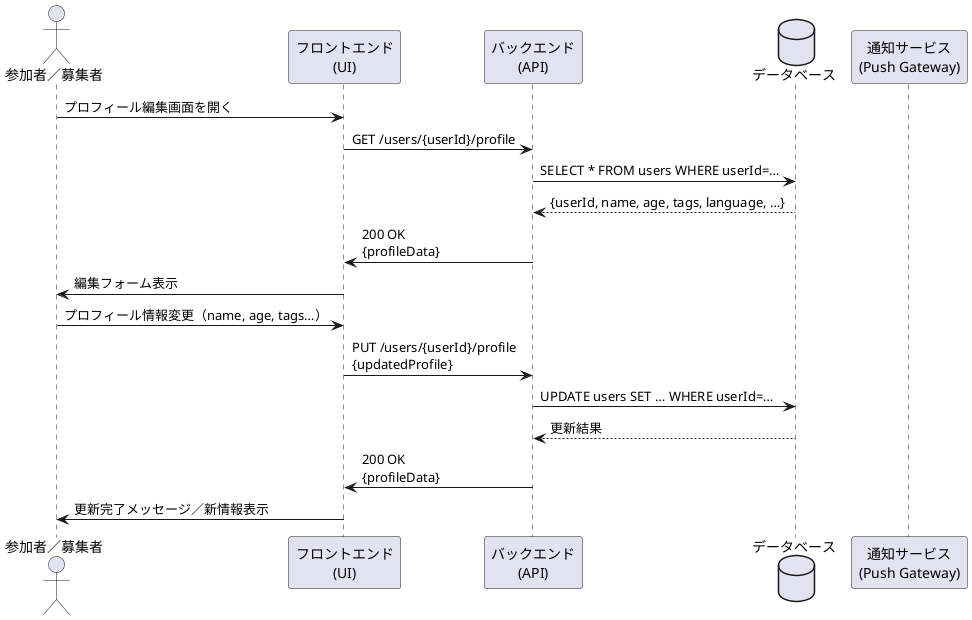

# プロフィール編集シーケンス図

## 概要
このドキュメントでは、USJマッチングアプリにおけるプロフィール編集機能のシーケンスについて説明します。

## アクター
- 参加者／募集者（User）
- フロントエンド（UI）
- バックエンド（API）
- データベース（DB）
- 通知サービス（Push Gateway）

## シーケンスの流れ
1. ユーザーがプロフィール編集画面を開く
2. フロントエンドがバックエンドにプロフィール情報をリクエスト
   - エンドポイント: GET /users/{userId}/profile
3. バックエンドがデータベースからユーザー情報を取得
   - クエリ: SELECT * FROM users WHERE userId=…
4. データベースがユーザー情報を返却
5. バックエンドがフロントエンドにプロフィール情報を返却
   - ステータス: 200 OK
   - レスポンス: プロフィールデータ
6. フロントエンドがユーザーに編集フォームを表示
7. ユーザーがプロフィール情報を変更（name, age, tagsなど）
8. フロントエンドがバックエンドに更新リクエストを送信
   - エンドポイント: PUT /users/{userId}/profile
   - リクエストボディ: updatedProfile
9. バックエンドがデータベースのユーザー情報を更新
   - クエリ: UPDATE users SET … WHERE userId=…
10. データベースが更新結果を返却
11. バックエンドがフロントエンドに更新完了を通知
    - ステータス: 200 OK
    - レスポンス: profileData
12. フロントエンドがユーザーに更新完了メッセージと新しい情報を表示

## シーケンス図
