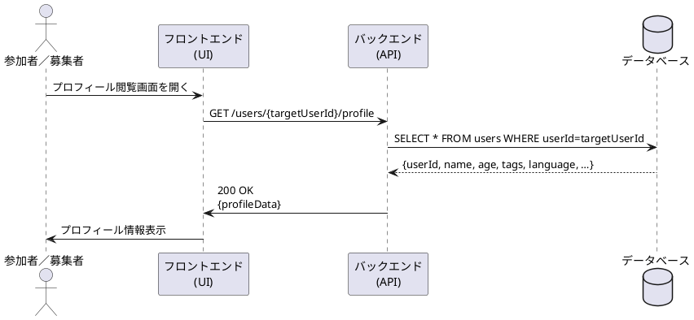

# プロフィール閲覧シーケンス図

## 概要
このドキュメントでは、USJマッチングアプリにおけるプロフィール閲覧機能のシーケンスについて説明します。

## アクター
- 参加者／募集者（User）
- フロントエンド（UI）
- バックエンド（API）
- データベース（DB）

## シーケンスの流れ
1. ユーザーがプロフィール閲覧画面を開く
2. フロントエンドがバックエンドにプロフィール情報をリクエスト
   - エンドポイント: GET /users/{targetUserId}/profile
3. バックエンドがデータベースからユーザー情報を取得
   - クエリ: SELECT * FROM users WHERE userId=targetUserId
4. データベースがユーザー情報を返却
   - 返却データ: userId, name, age, tags, language など
5. バックエンドがフロントエンドにプロフィール情報を返却
   - ステータス: 200 OK
   - レスポンス: プロフィールデータ
6. フロントエンドがユーザーにプロフィール情報を表示

## シーケンス図
