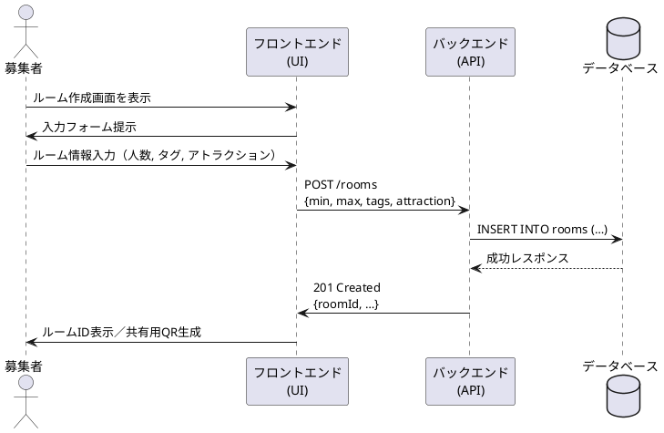

# ルーム作成シーケンス図

## 概要
このドキュメントでは、USJマッチングアプリにおけるルーム作成機能のシーケンスについて説明します。

## アクター
- 募集者（Recruiter）
- フロントエンド（UI）
- バックエンド（API）
- データベース（DB）

## シーケンスの流れ
1. 募集者がルーム作成画面を表示
2. フロントエンドが募集者に入力フォームを提示
3. 募集者がルーム情報を入力
   - 入力項目: 人数, タグ, アトラクション
4. フロントエンドがバックエンドにルーム作成リクエストを送信
   - エンドポイント: POST /rooms
   - リクエストボディ: min, max, tags, attraction
5. バックエンドがデータベースにルーム情報を登録
   - クエリ: INSERT INTO rooms (…)
6. データベースが成功レスポンスを返却
7. バックエンドがフロントエンドにルーム作成完了を通知
   - ステータス: 201 Created
   - レスポンス: roomId など
8. フロントエンドが募集者にルームIDを表示し、共有用QRコードを生成

## シーケンス図
