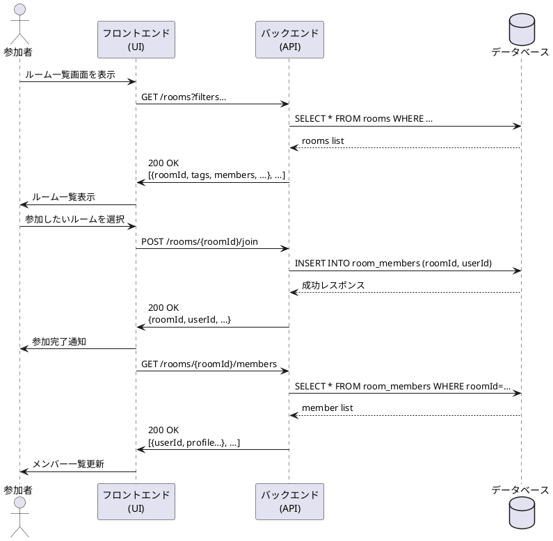

# ルーム参加シーケンス図

## 概要
このドキュメントでは、USJマッチングアプリにおけるルーム参加機能のシーケンスについて説明します。

## アクター
- 参加者（Participant）
- フロントエンド（UI）
- バックエンド（API）
- データベース（DB）

## シーケンスの流れ

### 1. ルーム一覧の表示
1. 参加者がルーム一覧画面を表示
2. フロントエンドがバックエンドにルーム一覧をリクエスト
   - エンドポイント: GET /rooms
   - パラメータ: filters
3. バックエンドがデータベースからルーム情報を取得
4. データベースがルーム一覧を返却
5. バックエンドがフロントエンドにルーム一覧を返却
   - ステータス: 200 OK
   - レスポンス: ルーム情報のリスト
6. フロントエンドが参加者にルーム一覧を表示

### 2. ルームへの参加
1. 参加者が参加したいルームを選択
2. フロントエンドがバックエンドに参加リクエストを送信
   - エンドポイント: POST /rooms/{roomId}/join
3. バックエンドがデータベースに参加情報を登録
   - クエリ: INSERT INTO room_members (roomId, userId)
4. データベースが成功レスポンスを返却
5. バックエンドがフロントエンドに参加完了を通知
   - ステータス: 200 OK
   - レスポンス: roomId, userId など
6. フロントエンドが参加者に参加完了を通知

### 3. メンバー一覧の更新
1. フロントエンドがバックエンドにメンバー一覧をリクエスト
   - エンドポイント: GET /rooms/{roomId}/members
2. バックエンドがデータベースからメンバー情報を取得
   - クエリ: SELECT * FROM room_members WHERE roomId=…
3. データベースがメンバー一覧を返却
4. バックエンドがフロントエンドにメンバー一覧を返却
   - ステータス: 200 OK
   - レスポンス: メンバー情報のリスト
5. フロントエンドが参加者にメンバー一覧を更新

## シーケンス図
