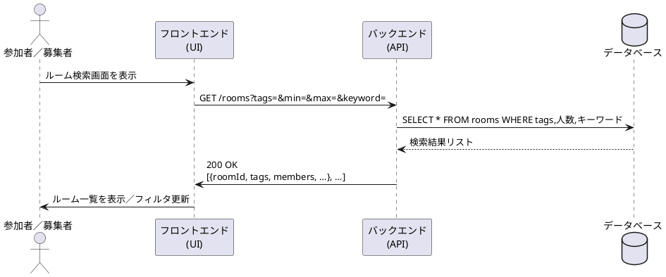

# ルーム検索シーケンス図

## 概要
このドキュメントでは、USJマッチングアプリにおけるルーム検索機能のシーケンスについて説明します。

## アクター
- 参加者／募集者（User）
- フロントエンド（UI）
- バックエンド（API）
- データベース（DB）

## シーケンスの流れ
1. ユーザーがルーム検索画面を表示
2. フロントエンドがバックエンドに検索リクエストを送信
   - エンドポイント: GET /rooms
   - パラメータ: tags, min, max, keyword
3. バックエンドがデータベースに検索クエリを実行
4. データベースが検索結果を返却
5. バックエンドがフロントエンドに検索結果を返却
   - ステータス: 200 OK
   - レスポンス: ルーム情報のリスト
6. フロントエンドがユーザーにルーム一覧を表示

## シーケンス図
