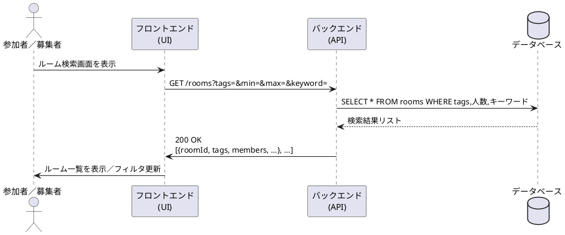
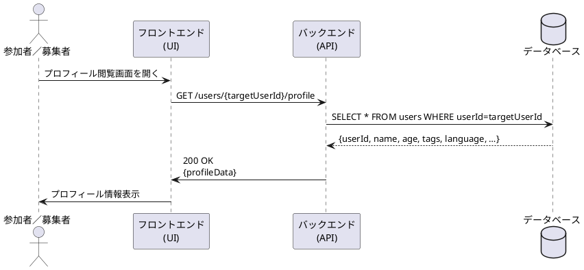
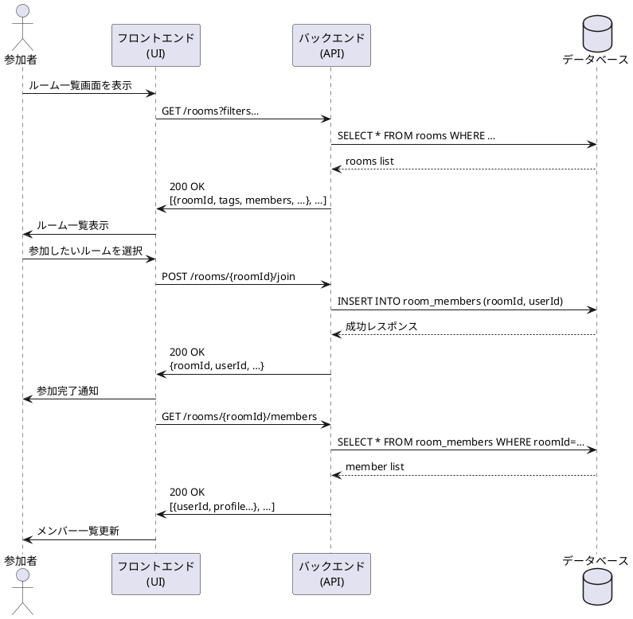
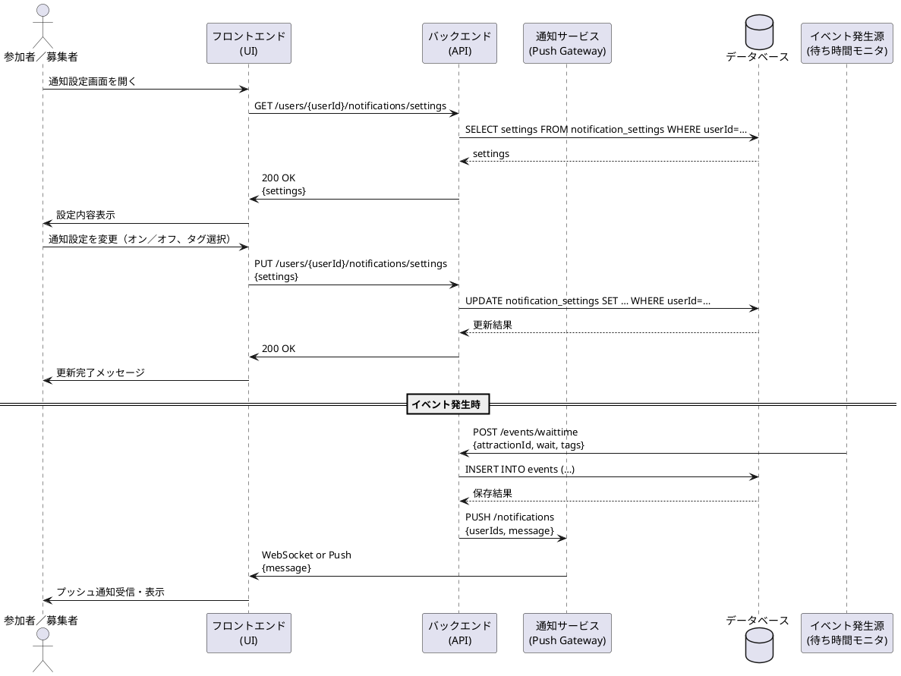
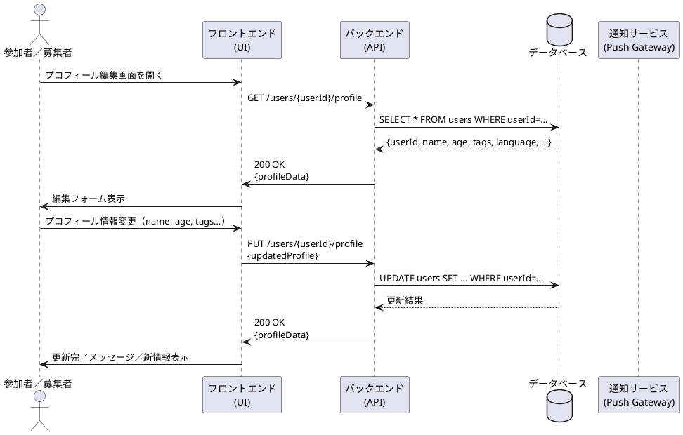
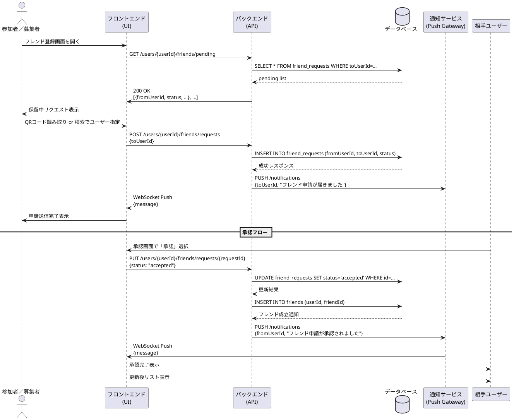
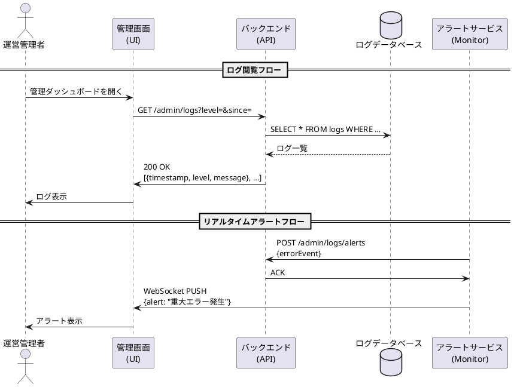
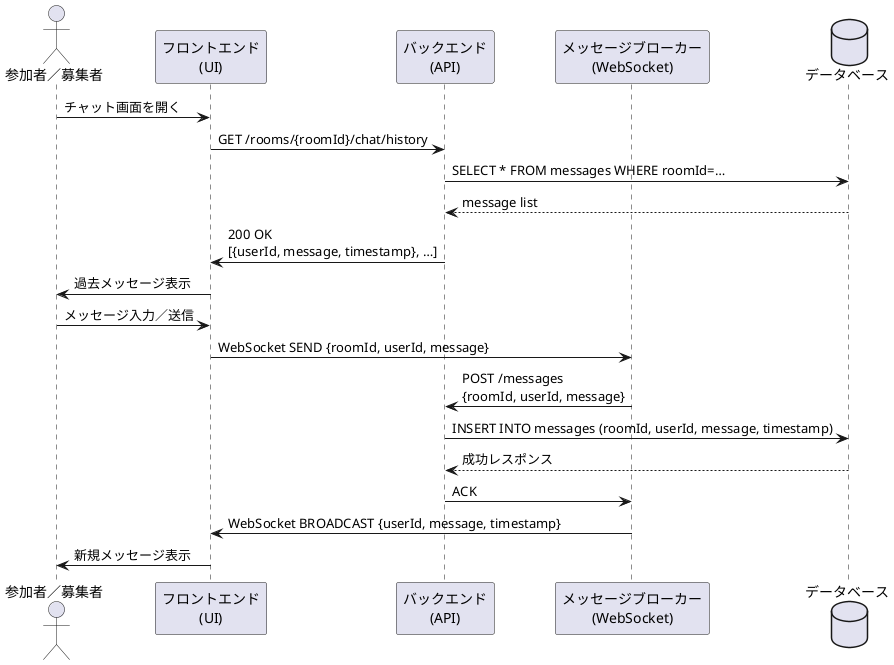
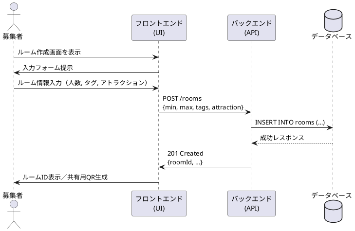

# シーケンス図一覧

このドキュメントでは、USJマッチングアプリの主要な機能のシーケンス図を一覧で表示します。

## 1. ルーム検索

```plantuml
@startuml
actor "参加者／募集者" as User
participant "フロントエンド\n(UI)" as Frontend
participant "バックエンド\n(API)"   as Backend
database "データベース"            as DB

User -> Frontend : ルーム検索画面を表示
Frontend -> Backend : GET /rooms?tags=&min=&max=&keyword=
Backend -> DB : SELECT * FROM rooms WHERE tags,人数,キーワード
DB --> Backend : 検索結果リスト
Backend -> Frontend : 200 OK\n[{roomId, tags, members, …}, …]
Frontend -> User : ルーム一覧を表示／フィルタ更新

@enduml
```

## 2. プロフィール閲覧

```plantuml
@startuml
actor "参加者／募集者" as User
participant "フロントエンド\n(UI)" as Frontend
participant "バックエンド\n(API)" as Backend
database "データベース" as DB

User -> Frontend : プロフィール閲覧画面を開く
Frontend -> Backend : GET /users/{targetUserId}/profile
Backend -> DB : SELECT * FROM users WHERE userId=targetUserId
DB --> Backend : {userId, name, age, tags, language, …}
Backend -> Frontend : 200 OK\n{profileData}
Frontend -> User : プロフィール情報表示

@enduml
```

## 3. ルーム参加

```plantuml
@startuml
actor "参加者" as Participant
participant "フロントエンド\n(UI)" as Frontend
participant "バックエンド\n(API)"   as Backend
database "データベース"            as DB

Participant -> Frontend : ルーム一覧画面を表示
Frontend -> Backend : GET /rooms?filters…
Backend -> DB : SELECT * FROM rooms WHERE …
DB --> Backend : rooms list
Backend -> Frontend : 200 OK\n[{roomId, tags, members, …}, …]
Frontend -> Participant : ルーム一覧表示

Participant -> Frontend : 参加したいルームを選択
Frontend -> Backend : POST /rooms/{roomId}/join
Backend -> DB : INSERT INTO room_members (roomId, userId)
DB --> Backend : 成功レスポンス
Backend -> Frontend : 200 OK\n{roomId, userId, …}
Frontend -> Participant : 参加完了通知

Frontend -> Backend : GET /rooms/{roomId}/members
Backend -> DB : SELECT * FROM room_members WHERE roomId=…
DB --> Backend : member list
Backend -> Frontend : 200 OK\n[{userId, profile…}, …]
Frontend -> Participant : メンバー一覧更新

@enduml
```

## 4. 通知機能

```plantuml
@startuml
actor "参加者／募集者" as User
participant "フロントエンド\n(UI)"        as Frontend
participant "バックエンド\n(API)"         as Backend
participant "通知サービス\n(Push Gateway)" as PushService
database "データベース"                   as DB

User -> Frontend : 通知設定画面を開く
Frontend -> Backend : GET /users/{userId}/notifications/settings
Backend -> DB : SELECT settings FROM notification_settings WHERE userId=…
DB --> Backend : settings
Backend -> Frontend : 200 OK\n{settings}
Frontend -> User : 設定内容表示

User -> Frontend : 通知設定を変更（オン／オフ、タグ選択）
Frontend -> Backend : PUT /users/{userId}/notifications/settings\n{settings}
Backend -> DB : UPDATE notification_settings SET … WHERE userId=…
DB --> Backend : 更新結果
Backend -> Frontend : 200 OK
Frontend -> User : 更新完了メッセージ

== イベント発生時 ==
participant "イベント発生源\n(待ち時間モニタ)" as EventSource
EventSource -> Backend : POST /events/waittime\n{attractionId, wait, tags}
Backend -> DB : INSERT INTO events (…)
DB --> Backend : 保存結果
Backend -> PushService : PUSH /notifications\n{userIds, message}
PushService -> Frontend : WebSocket or Push\n{message}
Frontend -> User : プッシュ通知受信・表示

@enduml
```

## 5. プロフィール編集

```plantuml
@startuml
actor "参加者／募集者" as User
participant "フロントエンド\n(UI)"       as Frontend
participant "バックエンド\n(API)"         as Backend
database "データベース"                   as DB
participant "通知サービス\n(Push Gateway)" as PushService

User -> Frontend : プロフィール編集画面を開く
Frontend -> Backend : GET /users/{userId}/profile
Backend -> DB : SELECT * FROM users WHERE userId=…
DB --> Backend : {userId, name, age, tags, language, …}
Backend -> Frontend : 200 OK\n{profileData}
Frontend -> User : 編集フォーム表示

User -> Frontend : プロフィール情報変更（name, age, tags…）
Frontend -> Backend : PUT /users/{userId}/profile\n{updatedProfile}
Backend -> DB : UPDATE users SET … WHERE userId=…
DB --> Backend : 更新結果
Backend -> Frontend : 200 OK\n{profileData}
Frontend -> User : 更新完了メッセージ／新情報表示

@enduml
```

## 6. フレンド登録

```plantuml
@startuml
actor "参加者／募集者" as User
participant "フロントエンド\n(UI)" as Frontend
participant "バックエンド\n(API)"   as Backend
database "データベース"            as DB
participant "通知サービス\n(Push Gateway)" as PushService

User -> Frontend : フレンド登録画面を開く
Frontend -> Backend : GET /users/{userId}/friends/pending
Backend -> DB : SELECT * FROM friend_requests WHERE toUserId=…
DB --> Backend : pending list
Backend -> Frontend : 200 OK\n[{fromUserId, status, …}, …]
Frontend -> User : 保留中リクエスト表示

User -> Frontend : QRコード読み取り or 検索でユーザー指定
Frontend -> Backend : POST /users/{userId}/friends/requests\n{toUserId}
Backend -> DB : INSERT INTO friend_requests (fromUserId, toUserId, status)
DB --> Backend : 成功レスポンス
Backend -> PushService : PUSH /notifications\n{toUserId, "フレンド申請が届きました"}
PushService -> Frontend : WebSocket Push\n{message}
Frontend -> User : 申請送信完了表示

== 承認フロー ==
participant "相手ユーザー" as TargetUser

TargetUser -> Frontend : 承認画面で「承認」選択
Frontend -> Backend : PUT /users/{userId}/friends/requests/{requestId}\n{status: "accepted"}
Backend -> DB : UPDATE friend_requests SET status='accepted' WHERE id=…
DB --> Backend : 更新結果
Backend -> DB : INSERT INTO friends (userId, friendId)
DB --> Backend : フレンド成立通知
Backend -> PushService : PUSH /notifications\n{fromUserId, "フレンド申請が承認されました"}
PushService -> Frontend : WebSocket Push\n{message}
Frontend -> TargetUser : 承認完了表示
Frontend -> TargetUser : 更新後リスト表示

@enduml
```

## 7. ログ監視

```plantuml
@startuml
actor "運営管理者" as Admin
participant "管理画面\n(UI)"         as AdminUI
participant "バックエンド\n(API)"     as Backend
database "ログデータベース"         as LogDB
participant "アラートサービス\n(Monitor)" as Monitor

== ログ閲覧フロー ==
Admin -> AdminUI : 管理ダッシュボードを開く
AdminUI -> Backend     : GET /admin/logs?level=&since=
Backend -> LogDB       : SELECT * FROM logs WHERE …
LogDB --> Backend      : ログ一覧
Backend -> AdminUI     : 200 OK\n[{timestamp, level, message}, …]
AdminUI -> Admin       : ログ表示

== リアルタイムアラートフロー ==
Monitor -> Backend     : POST /admin/logs/alerts\n{errorEvent}
Backend -> Monitor     : ACK
Monitor -> AdminUI     : WebSocket PUSH\n{alert: "重大エラー発生"}
AdminUI -> Admin       : アラート表示

@enduml
```

## 8. チャット

```plantuml
@startuml
actor "参加者／募集者" as User
participant "フロントエンド\n(UI)"     as Frontend
participant "バックエンド\n(API)"       as Backend
participant "メッセージブローカー\n(WebSocket)" as Broker
database "データベース"                as DB

User -> Frontend : チャット画面を開く
Frontend -> Backend : GET /rooms/{roomId}/chat/history
Backend -> DB : SELECT * FROM messages WHERE roomId=…
DB --> Backend : message list
Backend -> Frontend : 200 OK\n[{userId, message, timestamp}, …]
Frontend -> User : 過去メッセージ表示

User -> Frontend : メッセージ入力／送信
Frontend -> Broker : WebSocket SEND {roomId, userId, message}
Broker -> Backend : POST /messages\n{roomId, userId, message}
Backend -> DB : INSERT INTO messages (roomId, userId, message, timestamp)
DB --> Backend : 成功レスポンス
Backend -> Broker : ACK
Broker -> Frontend : WebSocket BROADCAST {userId, message, timestamp}
Frontend -> User : 新規メッセージ表示

@enduml
```

## 9. ルーム作成

```plantuml
@startuml
actor "募集者" as Recruiter
participant "フロントエンド\n(UI)" as Frontend
participant "バックエンド\n(API)"   as Backend
database "データベース"            as DB

Recruiter -> Frontend : ルーム作成画面を表示
Frontend -> Recruiter : 入力フォーム提示

Recruiter -> Frontend : ルーム情報入力（人数, タグ, アトラクション）
Frontend -> Backend : POST /rooms\n{min, max, tags, attraction}
Backend -> DB : INSERT INTO rooms (…)
DB --> Backend : 成功レスポンス
Backend -> Frontend : 201 Created\n{roomId, …}
Frontend -> Recruiter : ルームID表示／共有用QR生成

@enduml
``` 