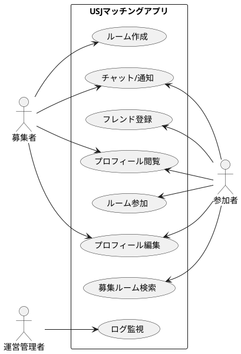

# 3. ユースケース図（Use Case Diagram）

## 概要
このドキュメントでは、USJマッチングアプリのユースケース図について説明します。

## アクター
- 募集者（Recruiter）
- 参加者（Participant）
- 運営管理者（Admin）

## ユースケース一覧

### 募集者（Recruiter）のユースケース
1. ルーム作成
2. チャット/通知
3. プロフィール閲覧
4. プロフィール編集

### 参加者（Participant）のユースケース
1. チャット/通知
2. フレンド登録
3. プロフィール閲覧
4. ルーム参加
5. プロフィール編集
6. 募集ルーム検索

### 運営管理者（Admin）のユースケース
1. ログ監視

## ユースケース図
